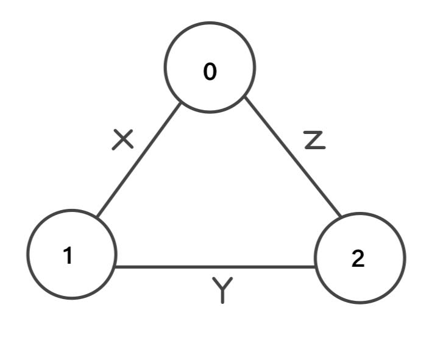
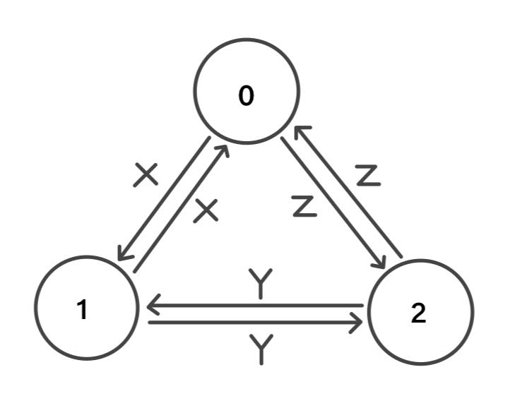
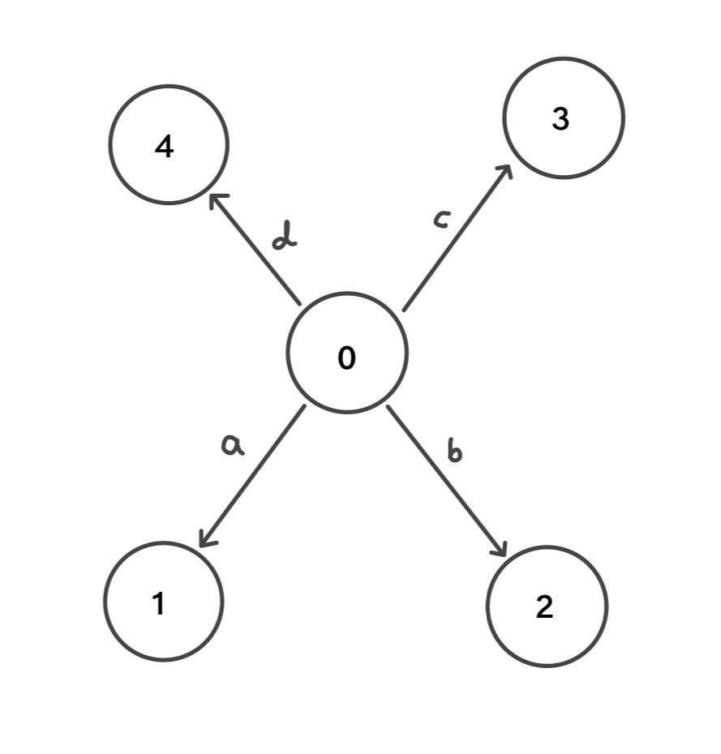

<!-- * Author: Sapir Dahan -->
<!--ID: 325732972 -->
<!-- * Mail: sapirdahan2003@gmail.com -->


# System 2 Project 1

## Description
This project implements algorithms for analyzing graphs, including checking for strong connectivity, finding the shortest path using the Bellman-Ford algorithm, detecting cycles, determine if there is a negative cycle, and determining if a graph is bipartite. It provides functionality for both directed and undirected graphs, where an undirected graph is treated as a special case of a directed graph with bidirectional edges.

For instance, this undirected graph:



will be treated as:



---

## How to Run the Project
### Compile the project

Use the provided `makefile` to build and run the project:
    
   - To build demo:
        ```bash
        make run
        ```
  - To build tests:
      ```bash
      make test
      ```
  - To check for memory leaks using Valgrind:
      ```bash
      make valgrind
      ```
  - To perform static code analysis using cppcheck:
      ```bash
      make cppcheck
      ```

### Run the project
After compiling, execute the relevant executable file.

- To run the demo
  ```bash
  ./demo
  ```
- To run the tests
  ```bash
  ./test
  ```

### Clean compiled files
To clean compiled files, run the command:
```bash
  make clean
  ```

---

## Files Included
- `Algorithms.cpp` and `Algorithms.hpp`: Implementation and header files for graph algorithms.
- `Graph.cpp` and `Graph.hpp`: Implementation and header files for the graph data structure.
- `Demo.cpp`: Demo application showcasing the implemented algorithms.
- `Test.cpp` and `TestCounter.cpp`: In Test we are checking a variety of scenarios and in TestCounter we count the tests and making sure there are more then 20.


---

## Functions
- **Strong Connectivity Check**: Determines if the graph is strongly connected, meaning there is a path between all pairs of vertices. For example, this graph is connected but not strongly connected, thus, the algorithm will return false.


  
- **Shortest Path Calculation**: Utilizes the Bellman-Ford algorithm to find the shortest path between any two vertices. It will return the path if existed. In addition, if there is a negative cycle in the path the algorithm will output it.
- **Cycle Detection**: Identifies if the graph contains any cycles. It will return the cycle if existed. For this project, we say there is a cycle in the graph only if it contains at least 3 different vertexes.
- **Bipartite Verification**: Checks if the graph is bipartite, meaning it can be colored with two colors such that no two adjacent vertices share the same color. If it is, it will return the two groups.
- **Negative Cycle Detection**: Determining if there a negative cycle in the graph.
- **Load Graph**: Load a matrix to be a graph object and trows error if the matrix is not square. It will also trow error if there is an edge from a vertex to itself.
- **Print Graph**: Return how many edges and vertexes a graph have.

In addition to the main functionalities mentioned earlier, the project includes several helper functions to support the core algorithms.